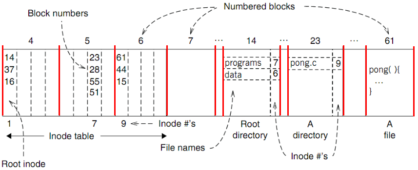
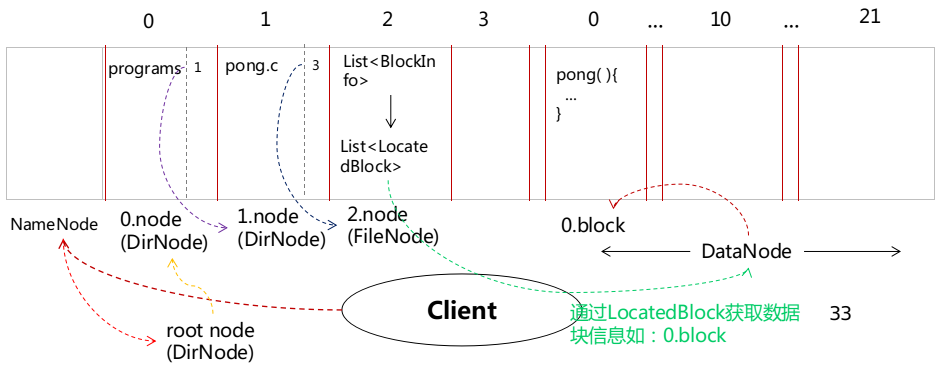

# Document 

————16302010059 张健

标签（空格分隔）： CSE SDFS Java

---

# 1. **Architecture of the system:**
> **整个系统包含四个主要角色：`NameNode`、`DataNode`、`Client`和`SDFSFileChannel`** 

***角色交互过程：***

- [x] **客户端读取指定路径文件内容或者往指定路径文件写内容：**
* 获取指定路径的SDFSFileChannel对象 `Client --> NameNode --> SDFSFileChannel`
* SDFSFileChannel包括对应FileNode信息 `SDFSFileChannel --> FileNode`
* 每个FileNode包括多个BlockInfo `FileNode --> BlockInfo`
* 根据BlockInfo对象可以寻找到单个块对应的所有备份，即LocatedBlock对象列表 `BlockInfo --> LocatedBlock`
* 根据不同的LocatedBlock中的blockNumber寻找到对应的DataNode节点上的数据块 `SDFSFileChannel --> DataNode`

---
- [x] **客户端往指定路径文件写内容：**
* 获取指定路径的SDFSFileChannel对象 `Client --> NameNode --> SDFSFileChannel`
* SDFSFileChannel获取FileNode的最后一个块，向其中写内容 `SDFSFileChannel --> FileNode --> BlockInfo --> LocatedBlock --> DataNode`
* 当对应的数据块没有剩余空间时，SDFSFileChannel向NameNode申请新的空闲块 `SDFSFileChannel --> NameNode`
* 将新的块信息添加到inode（这里是FileNode)中 `NameNode --> FileNode`
* 向新的空闲块写入内容 `SDFSFileChannel --> DataNode`

---
## 1.1. **NameNode:**
> **维护整个SDFS的INode信息，负责响应Client发起的操作，同时负责分配空闲块以及释放非空闲块**

**主要包含的方法及功能：**

- [x] OPEN:
```java
    //以”只读“方式打开一个文件流
    SDFSFileChannel openReadonly(String fileUri);
    //以”读写“方式打开一个文件流
    SDFSFileChannel openReadwrite(String fileUri);
    //通过唯一标识码fileUuid打开一个已存在的可”读“文件流
    SDFSFileChannel getReadonlyFile(UUID fileUuid);
    //通过唯一标识码fileUuid打开一个已存在的可”读写“文件流
    SDFSFileChannel getReadwriteFile(UUID fileUuid);
```
- [x] CREATE:
```java
    //新建一个文件
    //如果父目录不存在，则先创建父目录
    SDFSFileChannel create(String fileUri);
```
- [x] CLOSE:
```java
    //关闭一个“只读”文件流
    void closeReadonlyFile(UUID fileUuid);
    //关闭一个“读写”文件流
    void closeReadwriteFile(UUID fileUuid, int newFileSize)；
```
- [x] MKDIR:
```java
    //递归创建目录
    //如果父目录不存在，则先创建父目录
    void mkdir(String fileUri);
```
- [x] MANAGER BLOCKS:
```java
    //为一个文件添加一个空闲块
    //这个块备份blockAmount次，即每个文件的块有blockAmount个备份
    List<LocatedBlock> addBlocks(UUID fileUuid, int blockAmount);
    //删掉一个文件的最后blockAmount个块
    void removeLastBlocks(UUID fileUuid, int blockAmount);
```
___

## 1.2. **DataNode:**
**作为SDFS系统中存储数据的终端，提供 read 和 write 方法
来读写对应blockNumber标识的数据块，在读写的过程中可能会涉及到偏移量等参数**
___

## 1.3. **FileTree:**
**文件树结构，相当于Unix系统中的inode table**
___
 
### 1.3.1. **DirNode:**
> **目录节点，是文件树结构中的中间/叶子节点，可能有子节点**

#### 1.3.1.1. **Entry:**
> **以name-->node的键值对形式保存文件（文件夹/文件）节点信息**

### 1.3.2. **FileNode:**
> **文件节点，是文件树结构中的叶子节点**
#### 1.3.2.1. **BlockInfo:**
> **文件的一个数据块信息，每个文件包含一个List<BlockInfo>属性，即所有的数据块**
#### 1.3.2.2. **LocatedBlock:**
> **文件的一个数据块的数据备份（包含原始数据块），每个BlockInfo（即每个数据块）都有几个备份，即一个List<LocatedBlock>。
> 在分布式文件系统中，这种备份形式使得文件的容错性更高，当一个数据块失效时，可以通过数据块的备份恢复这个块**

## 1.4. **Client:**
**作为使用SDFS系统的终端，向SDFS系统读写文件**
___

### 1.4.1. **SDFSClient:**
**对NameNode提供的接口进行封装**

### 1.4.2. **SDFSFileChannel:**
**文件输入/输出流，含有读写指针**
**主要包含的方法及功能：**

- [x] READ：
* 找到当前读指针对应的第一个BlockInfo
* 选取备份中的一个或多个LocatedBlock(Lab1没实现完全，直接选取列表中的第一个）
* 寻找对应DataNode上的Block
* 将Block中的内容读取到dst中
* 读取下一个BlockInfo信息，继续读取相应Block内容
```java
    //从channel读取bytes到dst
    //从当前读取指针位置开始读取
    //更新当前指针到实际读取到的位置
    int read(ByteBuffer dst);
```
- [x] WRITE：
* 找到当前写指针对应的第一个BlockInfo
* 从前往后写入每个BlockInfo对应的LocatedBlock列表中的第一个
* 当第一个LocatedBlock写满后，将同样的内容写入其他备份的LocatedBlock
* 当BlockInfo用尽后，如果仍有数据未写入，则需要向NameNode申请一组备份系数的LocatedBlock，即进行addBlocks操作
* 将新申请到的这组LocatedBlock列表添加到 BlockInfo中
* 继续写操作
```java
    //将src包含的字节写入channel
    //从当前指针处开始写入字节
    //更新当前指针到最后写入的位置
    int write(ByteBuffer src);
```

## 1.5. **Util:**
**工具类**
___

### 1.5.1. **FileUtil:**
**关于文件的工具类，判断路径是否合法有效**

---

# 2. **Similarities and differences:**

## 2.1. **Similarities:**
* NameNode相当于Super Block，两者都起到管理空闲块的作用
* DataNode相当于INode Table，两者管理文件的元信息。
* filetree的内容相当于文件的块信息
    * 通过inode table找到某个inode下的某个block number，同时知道该inode是文件/目录
    * 对于目录DirNode，查询目录下的Entry，匹配文件名找到对应的inode number
    * 通过inode number找到新的inode
    * ……
___

## 2.2. **Differences:**
* 没有做的真正的分布式系统，至少这个lab没有分布式要求
* Unix文件系统下，应该是每个目录下都有对应的inode table信息，可以通过相对路径访问文件，但lab1实现的文件系统目前只支持绝对路径查询文件
___

## 2.3. **An example:**
**Find blocks of “/programs/pong.c”**

- [x] Unix File System


- [x] This File System


---

# 3. **Problems:**

---

## 3.1. **How to solve the only-one-writer problem:**
**判断所有打开的文件流中，是否存在对当前文件有“读写”权限的文件流**
```java

    /**
     * 判断一个文件fileNode是否以“读写”方式打开两次
     */
    private boolean readWriteTwice(FileNode fileNode) {
        Iterator<SDFSFileChannel> it;
        SDFSFileChannel channel;
        for (it = channels.values().iterator(); it.hasNext(); ) {
            channel = it.next();
            if (!channel.isReadOnly() && channel.getFileNodeId() == fileNode.getNodeId() && channel.isOpen())
                throw new IllegalStateException();
        }
        return false;
    }
```
---

## 3.2. **How to solve the changes-apply-after-close problem:**
> 1. Client修改文件内容
> 2. 修改每个SDSFFileChannel包含的FileNode实例信息（即对应的Blocks数据，并不会修改其他已打开的文件流FileNode信息，即使是同一个文件）
> 3. 调用Close函数
> 4. 调用Flush函数，将修改后的FileNode信息写会磁盘

---

## 3.3. **Format of the persistent file tree in my design:**
运行时，**文件树结构**是:

/  
|----parentDir1/  
|----|----childDir1/  
|----|----childDir2/  
|----|----|----file3  
|----parentDir2/  
|----file1  
|----file2  

即类似于一棵完整的B树
___
> 持久化存储时，每一个node只存储当前目录信息，以及下级目录信息
> 例如0.node，当前目录为“/”，下级目录信息包括“parentDir1”、“parentDir2”、“file1”和“file2”。
> 而1.node的当前目录为“parentDir1”，下级目录信息包含“childDir1”和“childDir2”，不存储下下级信息（即file3）
___
> 当读取文件树时，先读取根目录0.node信息
> 根据0.node找到下级目录信息
> 找到下级目录对应的node，读取node信息以获取下下级目录信息

---

# 4. **Bonus:**
有点晚了，应该没做什么额外的工作，硬说的话：

* 数据备份？在调用addBlocks函数时，传入参数blockAmount大于1，即使得每个数据块有blockAmount个备份，方便以后数据恢复。但我实际只是复制一些数据，没做什么其他的事。
* 使用版本库格式管理项目（git），同时在github上管理? [github项目地址](https://github.com/DarkYoung/SimpleDistributedFileSystem)

---

# 5. **Difficulties:**

## 5.1. **block:**
```java
   public List<LocatedBlock> addBlocks(UUID fileUuid, int blockAmount) throws IllegalStateException;
```
```java
   public void removeLastBlocks(UUID fileUuid, int blockAmount) throws IllegalStateException;
```
**个人理解：**

* addBlocks的参数blockAmount指备份(LocatedBlock)系数。
例如每个文件应当有三个备份（包含自身），`blockAmount=3`, addBlocks指添加一个数据块，但分配3个空闲块以保存备份。
* removeLastBlocks的参数blockAmount指数据块（BlockInfo)数，即释放一个文件的最后一个数据块内容指：释放掉最后一个BlockInfo的内容，如上例应释放最后一个BlockInfo的3个数据块（LocatedBlock）内容


## 5.2. **SDFSFileChannel:**
* 不注意看SDFSFileChannel的接口，一开始没能理解类方法的功能要求
* write操作需要考虑已有的FileNode中的BlockInfo是否充足，需要注意LocatedBlock的数据备份，当没有空闲空间时需要申请新的空闲块（addBlocks），需要注意与磁盘的同步问题。
* 不太理解已经实现的方法void setFileSize(long size)的作用，为什么可以直接设置一个文件的大小？看到测试文件调用此方法初始化文件大小（因为分配了空闲块，但没写入内容），如果文件不为空怎么办（参数size小于fileSize，是否调用truncate()方法）？

---


